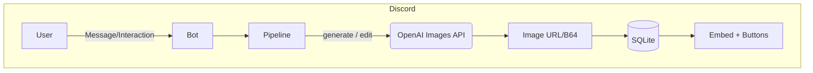

# GPT‑Image‑1 Discord Bot

> **Generate · Remix · Variate · Upscale · Share** — all from inside Discord, powered by **OpenAI GPT‑Image‑1**.
>
> ⚡ Built for fun hack‑n‑iterate workflows, now with *zero‑prompt* image editing, smart 16∶9 upscales, and bullet‑proof safety rails.

---

## ✨ Features

| Capability              | What it does                                                | How it works                                           |
| ----------------------- | ----------------------------------------------------------- | ------------------------------------------------------ |
| **Prompt‑to‑Image**     | `!img <prompt>` turns text into original art                | `openai.images.generate` with rich flag support        |
| **True Remix**          | Reply *laser eyes* → only that region is in‑painted         | Auto border‑outpaint → CLIP‑Seg mask → `images.edit`   |
| **Subtle Variation**    | One‑click *Variate* for gentle style shifts                 | Full‑canvas mask + hidden *preserve‑everything* prefix |
| **Smart Upscale**       | 1024² → **1536 × 1024** widescreen, no blur                 | Builds 16∶9 canvas, masks border, one in‑paint pass    |
| **Auto‑Resize Uploads** | Any user image is resized & centred to 1024² before editing | Pillow thumbnail + transparent border                  |
| **Paged Help**          | Interactive embeds with Prev / Next / Close                 | Discord UI Views                                       |
| **SQLite Cache**        | Every generation stored for lookup / cost stats             | Cheap, zero‑dependency persistence                     |
| **One‑Click Share**     | Send to a showcase channel                                  | Configurable `SHARE_CHANNEL_ID`                        |
| **Structured Logging**  | Cost + latency per call, colour‑coded                       | Python `logging`                                       |

---

## 🚀 Quick Start

```bash
# 1 · Clone & enter
$ git clone https://github.com/LilithXara/GPT-Image-1-Discord-Bot.git
$ cd GPT-Image-1-Discord-Bot

# 2 · Python 3.11+ env
$ python -m venv .venv && source .venv/bin/activate
$ pip install -r requirements.txt

# 3 · Secrets
$ cp .env.example .env   # then edit DISCORD_TOKEN & OPENAI_API_KEY

# 4 · Run
$ python image-1-discord-bot.py
```

> **Docker?** `docker compose up -d` runs the bot & a volume‑mounted `generated/` folder.

---

## ⚙️ Configuration (env vars)

| Variable           | Required? | Default       | Notes                                                                                                      |
| ------------------ | --------- | ------------- | ---------------------------------------------------------------------------------------------------------- |
| `DISCORD_TOKEN`    | ✅         | —             | Create a bot at [https://discord.com/developers/applications](https://discord.com/developers/applications) |
| `OPENAI_API_KEY`   | ✅         | —             | Key with **Images** scope                                                                                  |
| `SHARE_CHANNEL_ID` | ❌         | blank         | Channel ID for public sharing                                                                              |
| `BOT_PREFIX`       | ❌         | `!img`        | Change to `/slash` if using app‑commands                                                                   |
| `VISION_MODEL`     | ❌         | `gpt-4o-mini` | For auto‑caption & scope classifier                                                                        |
| `SAVE_DIR`         | ❌         | `generated/`  | All temp files + cache live here                                                                           |

All can also be edited inline at the top of `image-1-discord-bot.py`.

---

## 🖲️ Usage Cheatsheet

```text
!img                       → help pages
!img neon koi              → generate image
!img "pixel owl" --style pixel --size 1536x1024 --quality high

@Bot (with image)          → auto‑caption + buttons
@Bot laser eyes  (reply)   → remix that region only
Buttons: Upscale · Remix · Variate · Share
```

### Flag Reference

- `--size 1024x1024 | 1024x1536 | 1536x1024`
- `--quality low | medium | high`
- `--style vivid | natural | anime | cinematic | pixel`
- `--format png | jpeg | webp`
- `--transparent`       — force PNG with alpha
- `--seed <int>`         — deterministic generations
- `--n <int>`            — request 1‑10 images (cost scales!)

---

## 🛠️ Architecture (high‑level)



**Pipeline details**

1. **generate** → direct API call
2. **remix** → border‑outpaint → scope mask → edit
3. **variate** → full‑mask edit with subtle variance prompt
4. **upscale** → 16∶9 canvas + border mask → edit

---

## 🧩 Extending

- Add slash‑commands → wrap helpers in `discord.AppCommand`.
- Replace `CLIPSeg` with **Grounding DINO** + **SAM** for crisper masks.
- Swap SQLite for Postgres if you need multi‑bot stats.

---

## 🤝 Contributing

1. Fork → feature branch → PR (conventional commits).
2. `black -l 88` + `ruff --fix` before pushing.
3. Be excellent to each other. 🫶

---

## 📝 License

MIT — see `LICENSE` for details.

> Acknowledgements: huge thanks to the Discord.py community & OpenAI DevRel for early API access.

## 🙋 Support

Join our Discord server for help, feature requests, or just to share your creations: **[discord.gg/thelema](http://discord.gg/thelema)**

