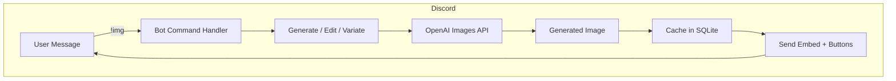

# 🖼️ GPT‑Image‑1 Discord Bot


> **Generate · Remix · Upscale · Share** — all from inside Discord, powered by OpenAI’s GPT‑Image‑1.

---

## ✨ Features

| |  |
|---|---|
| 🎨 **Prompt‑to‑Image** | `!img <prompt>` instantly turns text into gorgeous art. |
| 🔁 **Image Variations** | Create fresh takes on any image with a single click. |
| 🖍️ **True Remix** | Edit existing images *with* image guidance (border‑smart outpainting). |
| 🔍 **Smart Upscale** | Boost resolution and quality while preserving style. |
| 🤖 **Paged Help UI** | Built‑in interactive help embeds with Prev/Next navigation. |
| 💾 **SQLite Cache** | Remembers every generation for fast lookup & stats. |
| 🏷️ **Flexible Flags** | `--size`, `--quality`, `--style`, `--format`, `--transparent`, `--seed`, `--n`… |
| ☑️ **One‑Click Share** | Post creations to a public showcase channel. |
| 🔒 **Per‑User Controls** | Buttons only work for the image’s creator. |
| 📜 **Logging** | Structured log output for easy debugging & cost tracking. |

---

## 🚀 Quick Start

```bash
# 1. Clone the repo
$ git clone https://github.com/yourname/discord-image-bot.git && cd discord-image-bot

# 2. Install Python deps (3.11+ recommended)
$ python -m venv .venv && source .venv/bin/activate
$ pip install -r requirements.txt

# 3. Configure secrets (⇣ see below ⇣)
$ cp .env.example .env && $EDITOR .env

# 4. Run!
$ python discord_image_bot.py
```

> **Docker fan?** A ready‑made `Dockerfile` is included — `docker compose up -d` and you’re done.

---

## 🔧 Configuration

| Variable | Description |
|----------|-------------|
| `DISCORD_TOKEN` | Your Discord bot token. |
| `OPENAI_API_KEY` | OpenAI key with Images API access. |
| `BOT_PREFIX` | Command prefix (default `!img`). |
| `SHARE_CHANNEL_ID` | Channel ID where creations are showcased. |
| _Optional_ | `VISION_MODEL`, `SAVE_DIR`, etc. (see source). |

All config can be exported as env vars **or** edited inline at the top of `discord_image_bot.py`.

---

## 💬 Usage Cheatsheet

```text
!img               → paged help
!img neon koi      → generate image from prompt
!img "pixel owl" --style pixel --size 1536x1024 --quality high

@Bot (with image)  → auto‑caption + buttons
@Bot laser eyes     (reply) → remix via edit‑in‑place

Buttons: 🔍 Upscale • 🎨 Remix • 🔁 Variate • 📤 Share
```

### Flag Reference

* `--size 1024x1024` | `1024x1536` | `1536x1024`
* `--quality low | medium | high`
* `--style vivid | natural | anime | cinematic | pixel`
* `--format png | jpeg | webp`
* `--transparent` — force transparent background (PNG only)
* `--seed <int>` — deterministic generations
* `--n <int>` — request multiple images (max 10)

---

## 🏗️ Architecture



---

## 📸 Gallery

| Original | Remix | Upscale |
|----------|-------|---------|
|  |  |  |

*(Drop your own before/after shots in `assets/` and they’ll render here.)*

---

## 🛠️ Contributing

1. Fork → Feature branch → PR.
2. Follow `black`, `ruff`, and conventional commits.
3. Be excellent to each other.

---

## 📝 License

Released under the MIT License — see [`LICENSE`](LICENSE) for details.

> **Acknowledgements:** Massive thanks to the Discord.py community and the OpenAI DevRel team for early access and guidance.

